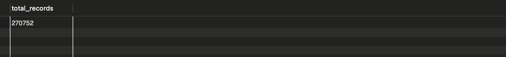

# Vehicle Crash Data Analysis: SQL, Python, Tableau.

# Project Objective

This project aims to analyze vehicle crash data to identify patterns, risk factors, and potential safety improvements through advanced SQL data analysis. The primary objectives are:

1. To investigate the relationship between environmental conditions (road surface, weather, lighting) and crash severity
2. To identify temporal patterns in crash occurrences across different months and conditions
3. To analyze the correlation between citations issued and crash outcomes
4. To develop a comprehensive risk assessment model for different driving conditions
5. To provide data-driven recommendations for improving road safety, particularly in adverse weather conditions

This analysis showcases SQL data manipulation and analysis techniques using MySQL, demonstrating proficiency in database design, query optimization, and statistical analysis. The findings from this project can potentially contribute to transportation safety policy and driver education programs in regions with similar climate challenges.

***

### Data set description

| Column Name               | Description                                                                 |
| :------------------------ | :-------------------------------------------------------------------------- |
| Report_number             | Unique state report number for the incident                                 |
| Report_seq_no             | Sequence number for each vehicle involved in a crash                         |
| DOT_Number                | Unique number assigned to a company by the DOT                               |
| Report_Date               | The date an incident occurred                                                |
| Report_State              | State abbreviation                                                            |
| Fatalities                | Total number of fatalities reported in the crash                             |
| Injuries                  | Total number of injuries reported in the crash                               |
| Tow_Away                  | 'Y' indicates that a vehicle involved in the crash was towed from the scene.  |
| Hazmat_released           | 'Y' indicates that hazardous materials were released at the time of a crash |
| Trafficway_Desc           | Description of the trafficway                                               |
| Access_Control_Desc       | Description of the access control                                           |
| Road_surface_Condition_Desc | Description of the road surface condition                                   |
| Weather_Condition_Desc    | Description of the weather condition                                        |
| Light_Condition_Desc      | Description of the light condition                                          |
| Vehicle_ID_Number         | Vehicle Identification number (VIN)                                         |
| Vehicle_License_number    | Vehicle license number                                                        |
| Vehicle_license_state     | Vehicle license state                                                         |
| Severity_Weight           | The severity weight that is assigned to the incident                          |
| Time_weight               | The time weight that is assigned to the incident                              |
| citation_issue_desc       | Description of the citation issue                                           |
| seq_num                   | Sequence number                                                             |
| Not_Preventable           | Crashes with a “Y” in the Not Preventable Flag column are excluded from SMS |

*** 

### **Procedure for Extracting Initial Information and Basic Cleaning in MySQL Workbench**


---

Now that we have the raw data, we should follow a structured approach to explore and clean it. The dataset is named **"2024oct_crash_full"** and contains information about vehicle crashes.


---
## **Step 1: Understanding the Data Structure**

Before making any changes, let's explore the dataset.


### **1.1 Check the Structure of the Table**


``` sql
-- 1.1 Check the Structure of the Table

DESCRIBE 2024oct_crash_full;

```

This will show the column names, data types, and whether they accept NULL values.


### **1.2 Preview the First Few Rows**
```SQL
-- 1.2 Preview the First Few Rows
SELECT * FROM 2024oct_crash_full LIMIT 10;
```
This helps us understand the type of data stored in each column.


### **1.3 Count the Total Number of Rows**
```sql
-- 1.3 Count the Total Number of Rows
SELECT COUNT(*) AS total_records 
FROM 2024oct_crash_full;
```
This provides an idea of the dataset’s size.


### **1.4 Check for Duplicates**
```sql
-- 1.4 Check for Duplicates
SELECT REPORT_NUMBER, COUNT(*)
FROM 2024oct_crash_full
GROUP BY REPORT_NUMBER, REPORT_SEQ_NO
HAVING COUNT(*) > 1;
```
Duplicates can occur if the same crash is recorded multiple times.


### 1.1 Check the Structure of the Table: 

### 1.2 Preview the First Few Rows: 

### 1.3 Count the Total Number of Rows: 

### 1.4 Check for Duplicates: 

*** 

## **Step 2 - Cleaning and Data Preparation**


### **2.1 Identifying and Handling Missing Data**


#### Weather and Road Conditions

```sql
-- 2.1 Check for NULL or Empty Values
SELECT 
    COUNT(*) AS total_records,
    SUM(CASE WHEN REPORT_NUMBER IS NULL OR REPORT_NUMBER = '' THEN 1 ELSE 0 END) AS missing_report_number,
    SUM(CASE WHEN ROAD_SURFACE_CONDITION_DESC IS NULL OR ROAD_SURFACE_CONDITION_DESC = '' THEN 1 ELSE 0 END) AS missing_surface_condtn,
    SUM(CASE WHEN REPORT_DATE IS NULL OR REPORT_DATE = '' THEN 1 ELSE 0 END) AS missing_report_date,
    SUM(CASE WHEN REPORT_STATE IS NULL OR REPORT_STATE = '' THEN 1 ELSE 0 END) AS missing_report_state,
    SUM(CASE WHEN WEATHER_CONDITION_DESC IS NULL OR WEATHER_CONDITION_DESC = '' THEN 1 ELSE 0 END) AS missing_weather,
    SUM(CASE WHEN LIGHT_CONDITION_DESC IS NULL OR LIGHT_CONDITION_DESC = '' THEN 1 ELSE 0 END) AS missing_light_condtns,
    SUM(CASE WHEN VEHICLE_LICENSE_NUMBER IS NULL OR VEHICLE_LICENSE_NUMBER = '' THEN 1 ELSE 0 END) AS missing_license_number
FROM 2024oct_crash_full;

-- 2.2 Replace missing or empty values for each field
-- Disable safe update mode
SET SQL_SAFE_UPDATES = 0;

UPDATE 2024oct_crash_full
SET REPORT_NUMBER = CASE WHEN REPORT_NUMBER IS NULL OR REPORT_NUMBER = '' THEN 'UNKNOWN' ELSE REPORT_NUMBER END,
    ROAD_SURFACE_CONDITION_DESC = CASE WHEN ROAD_SURFACE_CONDITION_DESC IS NULL OR ROAD_SURFACE_CONDITION_DESC = '' THEN 'NOT SPECIFIED' ELSE ROAD_SURFACE_CONDITION_DESC END,
    REPORT_DATE = CASE WHEN REPORT_DATE IS NULL OR REPORT_DATE = '' THEN '1900-01-01' ELSE REPORT_DATE END,
    REPORT_STATE = CASE WHEN REPORT_STATE IS NULL OR REPORT_STATE = '' THEN 'UNKNOWN' ELSE REPORT_STATE END,
    WEATHER_CONDITION_DESC = CASE WHEN WEATHER_CONDITION_DESC IS NULL OR WEATHER_CONDITION_DESC = '' THEN 'NOT SPECIFIED' ELSE WEATHER_CONDITION_DESC END,
    LIGHT_CONDITION_DESC = CASE WHEN LIGHT_CONDITION_DESC IS NULL OR LIGHT_CONDITION_DESC = '' THEN 'NOT SPECIFIED' ELSE LIGHT_CONDITION_DESC END,
    VEHICLE_LICENSE_NUMBER = CASE WHEN VEHICLE_LICENSE_NUMBER IS NULL OR VEHICLE_LICENSE_NUMBER = '' THEN 'N/A' ELSE VEHICLE_LICENSE_NUMBER END;

-- Re-enable safe update mode
SET SQL_SAFE_UPDATES = 1;

-- CHECK if replaced
SELECT REPORT_NUMBER, ROAD_SURFACE_CONDITION_DESC FROM 2024oct_crash_full
WHERE ROAD_SURFACE_CONDITION_DESC IS NULL OR ROAD_SURFACE_CONDITION_DESC = '';
```

```python

```

#### Injuries and Fatalities


```sql
-- 2.1 Check for NULL or Empty Values
SELECT 
    COUNT(*) AS total_records,
    SUM(CASE WHEN REPORT_NUMBER IS NULL OR REPORT_NUMBER = '' THEN 1 ELSE 0 END) AS missing_report_number,
    SUM(CASE WHEN FATALITIES IS NULL OR FATALITIES = '' THEN 1 ELSE 0 END) AS NO_FATALITIES,
    SUM(CASE WHEN INJURIES IS NULL OR INJURIES = '' THEN 1 ELSE 0 END) AS NO_INJURIES,
    SUM(CASE WHEN TOW_AWAY IS NULL OR TOW_AWAY = '' THEN 1 ELSE 0 END) AS missing_TOW_AWAY,
    SUM(CASE WHEN HAZMAT_RELEASED IS NULL OR HAZMAT_RELEASED = '' THEN 1 ELSE 0 END) AS missing_HAZMAT_RELEASED,
    SUM(CASE WHEN SEVERITY_WEIGHT IS NULL OR SEVERITY_WEIGHT = '' THEN 1 ELSE 0 END) AS missing_SEVERITY_WEIGHT,
    SUM(CASE WHEN VEHICLE_LICENSE_STATE IS NULL OR VEHICLE_LICENSE_STATE = '' THEN 1 ELSE 0 END) AS missing_VEHICLE_LICENSE_STATE
FROM 2024oct_crash_full;

-- 2.2 Replace missing or empty values for each field
-- Disable safe update mode
SET SQL_SAFE_UPDATES = 0;

UPDATE 2024oct_crash_full
SET 
	REPORT_NUMBER = CASE WHEN REPORT_NUMBER IS NULL OR REPORT_NUMBER = '' THEN 'UNKNOWN' ELSE REPORT_NUMBER END,
    FATALITIES = CASE WHEN FATALITIES IS NULL OR FATALITIES = '' THEN 0 ELSE FATALITIES END,
    INJURIES = CASE WHEN INJURIES IS NULL OR INJURIES = '' THEN 0 ELSE INJURIES END,
    TOW_AWAY = CASE WHEN TOW_AWAY IS NULL OR TOW_AWAY = '' THEN 'NO' ELSE TOW_AWAY END,
	HAZMAT_RELEASED = CASE WHEN HAZMAT_RELEASED IS NULL OR HAZMAT_RELEASED = '' THEN 'NO' ELSE HAZMAT_RELEASED END,
    SEVERITY_WEIGHT = CASE WHEN SEVERITY_WEIGHT IS NULL OR SEVERITY_WEIGHT = '' THEN 0 ELSE SEVERITY_WEIGHT END,
    VEHICLE_LICENSE_STATE = CASE WHEN VEHICLE_LICENSE_STATE IS NULL OR VEHICLE_LICENSE_STATE = '' THEN 'UNKNOWN' ELSE VEHICLE_LICENSE_STATE END,
    VEHICLE_LICENSE_NUMBER = CASE WHEN VEHICLE_LICENSE_NUMBER IS NULL OR VEHICLE_LICENSE_NUMBER = '' THEN 'NO' ELSE VEHICLE_LICENSE_NUMBER END
WHERE REPORT_NUMBER = '' OR FATALITIES IS NULL OR FATALITIES = '' OR INJURIES = '' 
   OR TOW_AWAY = '' OR HAZMAT_RELEASED = '' OR SEVERITY_WEIGHT = '' 
   OR VEHICLE_LICENSE_STATE = '' OR VEHICLE_LICENSE_NUMBER = '';

-- Re-enable safe update mode
SET SQL_SAFE_UPDATES = 1;
```


*** 

### **2.2 Data Type Validation ana Conversion**

```sql
-- Validate Date Formats

SELECT REPORT_DATE FROM 2024oct_crash_full

WHERE STR_TO_DATE(REPORT_DATE, '%d-%b-%y') IS NULL;

If invalid dates are found, we need to correct them.


-- Convert Report Date to Proper Format

UPDATE 2024oct_crash_full

SET REPORT_DATE = STR_TO_DATE(REPORT_DATE, '%d-%b-%y');
```


```python

```

```sql
-- Check the correct REPORT_STATE format

SELECT DISTINCT REPORT_NUMBER, REPORT_STATE
FROM 2024oct_crash_full
WHERE REPORT_STATE NOT IN (
    'AL', 'AK', 'AZ', 'AR', 'DC', 'CA', 'CO', 'CT', 'DE', 'FL', 'GA', 
    'HI', 'ID', 'IL', 'IN', 'IA', 'KS', 'KY', 'LA', 'ME', 'MD', 
    'MA', 'MI', 'MN', 'MS', 'MO', 'MT', 'NE', 'NV', 'NH', 'NJ', 
    'NM', 'NY', 'NC', 'ND', 'OH', 'OK', 'OR', 'PA', 'RI', 'SC', 
    'SD', 'TN', 'TX', 'UT', 'VT', 'VA', 'WA', 'WV', 'WI', 'WY'
);

-- Validate Date Formats
SELECT REPORT_DATE FROM 2024oct_crash_full 
WHERE STR_TO_DATE(REPORT_DATE, '%d-%b-%y') IS NULL;

-- ................................................
-- Convert Report Date to Proper Format
-- Disable safe update mode
SET SQL_SAFE_UPDATES = 0;

UPDATE 2024oct_crash_full
SET REPORT_DATE = STR_TO_DATE(REPORT_DATE, '%d-%b-%y');

-- Re-enable safe update mode
SET SQL_SAFE_UPDATES = 1;
```

*** 

### **2.3 Standardizing Data**

**Purpose**:
   - The `TRIM` function ensures no leading or trailing whitespace exists in any field, standardizing data and reducing errors.


```sql
-- Trim Extra Spaces

-- Disable safe update mode
SET SQL_SAFE_UPDATES = 0;

UPDATE 2024oct_crash_full
SET 
    REPORT_NUMBER = TRIM(REPORT_NUMBER),
    REPORT_STATE = TRIM(REPORT_STATE),
    WEATHER_CONDITION_DESC = TRIM(WEATHER_CONDITION_DESC),
    ROAD_SURFACE_CONDITION_DESC = TRIM(ROAD_SURFACE_CONDITION_DESC),
    LIGHT_CONDITION_DESC = TRIM(LIGHT_CONDITION_DESC),
    VEHICLE_LICENSE_NUMBER = TRIM(VEHICLE_LICENSE_NUMBER),
    FATALITIES = TRIM(FATALITIES),
    INJURIES = TRIM(INJURIES),
    TOW_AWAY = TRIM(TOW_AWAY),
    HAZMAT_RELEASED = TRIM(HAZMAT_RELEASED),
    SEVERITY_WEIGHT = TRIM(SEVERITY_WEIGHT),
    VEHICLE_LICENSE_STATE = TRIM(VEHICLE_LICENSE_STATE),
    REPORT_DATE = TRIM(REPORT_DATE);

-- Re-enable safe update mode
SET SQL_SAFE_UPDATES = 1;
```

*** 

### **2.4 Handling Duplicates**

**Purpose:**
- If duplicate vehicle records exist, we might need to handle them based on additional columns.


```sql
-- The vehicles involved in more than 1 crash:

SELECT 
    VEHICLE_LICENSE_NUMBER, VEHICLE_LICENSE_STATE,
    COUNT(*) AS ACCIDENTS,
    MAX(REPORT_DATE) AS LATEST_REPORT_DATE,
    MAX(REPORT_STATE) AS LATEST_REPORT_STATE
FROM 2024oct_crash_full
GROUP BY VEHICLE_LICENSE_NUMBER, VEHICLE_LICENSE_STATE
HAVING COUNT(*) > 1
ORDER BY ACCIDENTS DESC;
```

### Handling Duplicates:  

*** 

## Step 3 - Summary Statistics: Initial Insights


```sql

-- 1. This provides an overview of the dataset.

SELECT 
    COUNT(*) AS total_crashes,
    COUNT(DISTINCT REPORT_NUMBER) AS total_accidents, -- There may be more than one vehicle involved.
    COUNT(DISTINCT REPORT_STATE) AS unique_states,
    COUNT(DISTINCT VEHICLE_LICENSE_NUMBER) AS unique_vehicles
FROM 2024oct_crash_full;

-- ========================

-- 2. Number of crashes by state
SELECT 
    REPORT_STATE,
    COUNT(DISTINCT REPORT_NUMBER) AS accident_count
FROM 2024oct_crash_full
WHERE REPORT_STATE IN (
    'AL', 'AK', 'AZ', 'AR', 'CA', 'CO', 'CT', 'DE', 'FL', 'GA', 
    'HI', 'ID', 'IL', 'IN', 'IA', 'KS', 'KY', 'LA', 'ME', 'MD', 
    'MA', 'MI', 'MN', 'MS', 'MO', 'MT', 'NE', 'NV', 'NH', 'NJ', 
    'NM', 'NY', 'NC', 'ND', 'OH', 'OK', 'OR', 'PA', 'RI', 'SC', 
    'SD', 'TN', 'TX', 'UT', 'VT', 'VA', 'WA', 'WV', 'WI', 'WY', 'DC'
)
GROUP BY REPORT_STATE
ORDER BY accident_count DESC;
```

### The overview of the dataset:  

### Number of crashes by state 

*** 

*** 

# Exploratory Data Analysis

## **1. Crash Hotspots by State**
>**Objective:** Identify which states have the highest number of trucking-related incidents.

**Business Value:**
- Helps optimize route planning by avoiding accident-prone areas.
- Allows for insurance risk assessment, adjusting policies based on state-specific risks.


I modified the query to handle the different state formats. Since one table uses state abbreviations (like AL, AK) and the other uses full state names (like Alabama, Alaska), we need to join them using a *mapping* between the two formats:

```sql
-- Normalize crashes per 1,000 people for better risk assessment:
SELECT c.REPORT_STATE, (COUNT(*) / p.Population) * 1000 AS crashes_per_1000_people
FROM 2024oct_crash_full c
JOIN population_by_state_oct24 p ON 
    CASE c.REPORT_STATE
        WHEN 'AL' THEN 'Alabama'
        WHEN 'AK' THEN 'Alaska'
        WHEN 'AZ' THEN 'Arizona'
        WHEN 'AR' THEN 'Arkansas'
        WHEN 'CA' THEN 'California'
        WHEN 'CO' THEN 'Colorado'
        WHEN 'CT' THEN 'Connecticut'
        WHEN 'DE' THEN 'Delaware'
        WHEN 'FL' THEN 'Florida'
        WHEN 'GA' THEN 'Georgia'
        WHEN 'HI' THEN 'Hawaii'
        WHEN 'ID' THEN 'Idaho'
        WHEN 'IL' THEN 'Illinois'
        WHEN 'IN' THEN 'Indiana'
        WHEN 'IA' THEN 'Iowa'
        WHEN 'KS' THEN 'Kansas'
        WHEN 'KY' THEN 'Kentucky'
        WHEN 'LA' THEN 'Louisiana'
        WHEN 'ME' THEN 'Maine'
        WHEN 'MD' THEN 'Maryland'
        WHEN 'MA' THEN 'Massachusetts'
        WHEN 'MI' THEN 'Michigan'
        WHEN 'MN' THEN 'Minnesota'
        WHEN 'MS' THEN 'Mississippi'
        WHEN 'MO' THEN 'Missouri'
        WHEN 'MT' THEN 'Montana'
        WHEN 'NE' THEN 'Nebraska'
        WHEN 'NV' THEN 'Nevada'
        WHEN 'NH' THEN 'New Hampshire'
        WHEN 'NJ' THEN 'New Jersey'
        WHEN 'NM' THEN 'New Mexico'
        WHEN 'NY' THEN 'New York'
        WHEN 'NC' THEN 'North Carolina'
        WHEN 'ND' THEN 'North Dakota'
        WHEN 'OH' THEN 'Ohio'
        WHEN 'OK' THEN 'Oklahoma'
        WHEN 'OR' THEN 'Oregon'
        WHEN 'PA' THEN 'Pennsylvania'
        WHEN 'RI' THEN 'Rhode Island'
        WHEN 'SC' THEN 'South Carolina'
        WHEN 'SD' THEN 'South Dakota'
        WHEN 'TN' THEN 'Tennessee'
        WHEN 'TX' THEN 'Texas'
        WHEN 'UT' THEN 'Utah'
        WHEN 'VT' THEN 'Vermont'
        WHEN 'VA' THEN 'Virginia'
        WHEN 'WA' THEN 'Washington'
        WHEN 'WV' THEN 'West Virginia'
        WHEN 'WI' THEN 'Wisconsin'
        WHEN 'WY' THEN 'Wyoming'
        WHEN 'DC' THEN 'District of Columbia'
    END = p.State
GROUP BY c.REPORT_STATE, p.Population
ORDER BY crashes_per_1000_people DESC;
```

This query uses a `CASE` statement to map the state abbreviations from the `2024oct_crash_full` table to the full state names used in the `population_by_state_oct24` table. I've also added table aliases (`c` and `p`) to make the query more readable.
I've multiplied the original crashes_per_capita by 1000 to get crashes per 1,000 people and named the column to reflect this change. This metric is more intuitive and commonly used in safety and transportation statistics.

### Crash Hotspots by State: 

***

## **2. Crash Pattern Analysis by Date and Season**
>**Objective:** Identify crash trends based on time of year, days of the week, and seasonality.


**Business Value:**
- Helps trucking companies plan driver schedules to avoid high-risk periods.
- Improves seasonal preparedness by reinforcing safety protocols during hazardous months.


#### **2.1 Detailed Day-of-Week Analysis with Time of Day**


```sql
-- Detailed Day-of-Week Analysis with Time of Day

SELECT 
    DATE_FORMAT(CAST(Report_Date AS DATE), '%W') AS day_of_week,
    LIGHT_CONDITION_DESC,
    COUNT(*) as incident_count,
    ROUND(COUNT(*) * 100.0 / SUM(COUNT(*)) OVER (PARTITION BY DATE_FORMAT(CAST(Report_Date AS DATE), '%W')), 2) as day_percentage
FROM 2024oct_crash_full
GROUP BY 
    day_of_week,
    LIGHT_CONDITION_DESC
ORDER BY 
    FIELD(day_of_week, 
          'Monday', 'Tuesday', 'Wednesday', 'Thursday', 'Friday', 'Saturday', 'Sunday'),
    incident_count DESC;
    
```

### Crash Pattern Analysis by day of the week: 

#### **2.2 Crash Pattern by Month**
> The SQL query to find the **busiest months** for incidents:

```sql
-- Find the busiest months for incidents:

SELECT 
    MONTH(CAST(Report_Date AS DATE)) AS crash_month,
    DATE_FORMAT(CAST(Report_Date AS DATE), '%M') AS month_name,
    COUNT(*) AS total_crashes
FROM 2024oct_crash_full
GROUP BY 
    MONTH(CAST(Report_Date AS DATE)),
    DATE_FORMAT(CAST(Report_Date AS DATE), '%M')
ORDER BY 
    total_crashes DESC,
    crash_month;
```

> This gives you a clear view of which months had the **most incidents**, with both the numeric month and month name for easy reference.

### Crash Pattern Analysis by month 

#### **2.3 Monthly Trend Analysis for Seasonal Planning**


```sql
-- Monthly Trend Analysis for Seasonal Planning

SELECT 
    DATE_FORMAT(CAST(Report_Date AS DATE), '%M') AS month,
    CASE 
        WHEN WEEKDAY(CAST(Report_Date AS DATE)) IN (5,6) THEN 'Weekend'
        ELSE 'Weekday'
    END AS day_type,
    COUNT(*) as crash_count,
    WEATHER_CONDITION_DESC,
    ROAD_SURFACE_CONDITION_DESC,
    LIGHT_CONDITION_DESC
FROM 2024oct_crash_full
GROUP BY 
    month,
    day_type,
    WEATHER_CONDITION_DESC,
    ROAD_SURFACE_CONDITION_DESC,
    LIGHT_CONDITION_DESC
ORDER BY 
    month,
    day_type,
    crash_count DESC;
```


### Monthly Trend Analysis for Seasonal Planning  

#### **2.4 Weekday vs. Weekend Crashes with Road Conditions**
> **Objective:** Identify **high-risk days** (weekends vs. weekdays):

```sql
-- Weekday vs Weekend Crashes with Road Conditions

SELECT 
    CASE 
        WHEN WEEKDAY(CAST(Report_Date AS DATE)) IN (5,6) THEN 'Weekend'
        ELSE 'Weekday'
    END AS day_type,
    ROAD_SURFACE_CONDITION_DESC,
    COUNT(*) as crash_count,
    ROUND(COUNT(*) * 100.0 / SUM(COUNT(*)) OVER (PARTITION BY CASE 
        WHEN WEEKDAY(CAST(Report_Date AS DATE)) IN (5,6) THEN 'Weekend'
        ELSE 'Weekday'
    END), 2) as percentage
FROM 2024oct_crash_full
GROUP BY 
    day_type,
    ROAD_SURFACE_CONDITION_DESC
ORDER BY 
    day_type,
    crash_count DESC;
    ```

### Weekdays vs. weekends vs. road conditions  

#### **2.5 Daily Number of Crashes by State**

```sql
-- All states the daily number of crashes

SELECT REPORT_DATE, count(REPORT_NUMBER) as All_States_num_of_crashes
FROM 2024oct_crash_full
GROUP BY REPORT_DATE
ORDER BY REPORT_DATE
;

### All states daily number of crashes  


#### **2.6 Compare day vs. night crash rates**
```sql
 SELECT 
    CASE 
        WHEN Light_Condition_Desc LIKE 'Dark%' THEN 'Night'
        ELSE 'Day'
    END AS time_of_day, 
    COUNT(*) AS total_crashes
FROM 2024oct_crash_full
GROUP BY time_of_day;

### Day vs. night crash rates  

***

## **3. Impact of Road Surface Conditions on Accidents**
>**Objective:** Determine how road conditions affect crash frequency and severity.


```sql
-- Identify the most dangerous road conditions:

SELECT Road_surface_Condition_Desc, COUNT(*) AS total_crashes
FROM 2024oct_crash_full
GROUP BY Road_surface_Condition_Desc
ORDER BY total_crashes DESC;
```

### Impact of Road Surface Conditions  

**Business Value:**
- Helps improve driver training on handling dangerous road conditions.
- Supports predictive maintenance decisions (e.g., using better tires in icy regions).


***


## **4. Weather Conditions & Crash Risk**

>**Objective:** Identify how different weather conditions contribute to accidents.


**Business Value:**
- Enables proactive safety measures (e.g., slowing down in foggy areas).
- Helps in fleet management, advising drivers to reroute in dangerous weather.


#### **4.1 Impact of light conditions**

```sql
SELECT LIGHT_CONDITION_DESC, COUNT(*) AS total_light_crashes
FROM 2024oct_crash_full
GROUP BY LIGHT_CONDITION_DESC
ORDER BY total_light_crashes DESC;
```

### Impact of light condtns  

#### **4.2 Rank weather conditions by crash frequency**

```sql
SELECT Weather_Condition_Desc, COUNT(*) AS total_crashes
FROM 2024oct_crash_full
GROUP BY Weather_Condition_Desc
ORDER BY total_crashes DESC;
```


### Rank weather conditions by crash frequency  

#### **4.3 Combine with road surface conditions for deeper insights**

```sql
SELECT Weather_Condition_Desc, Road_surface_Condition_Desc, COUNT(*) AS total_crashes
FROM 2024oct_crash_full
GROUP BY Weather_Condition_Desc, Road_surface_Condition_Desc
ORDER BY total_crashes DESC;
```

### Combine weather with road surface conditions  
